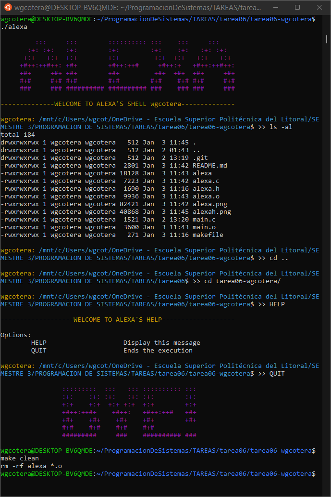
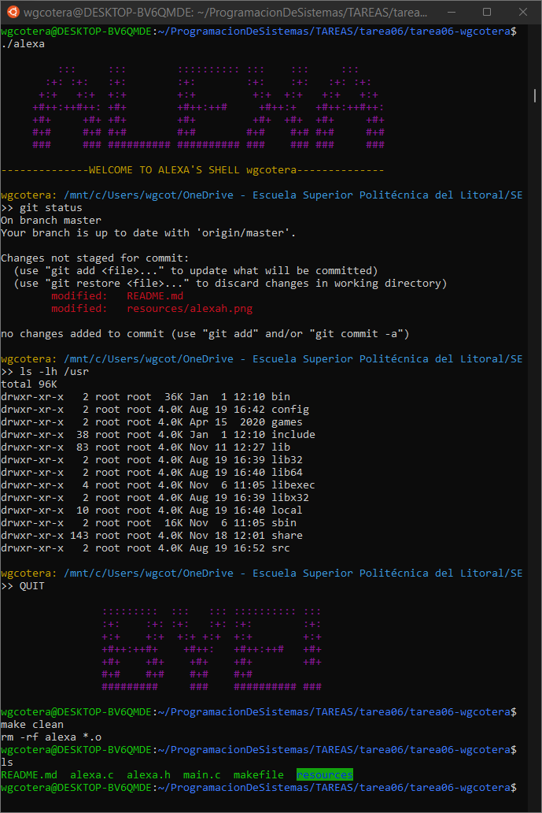

# USE OF fork() AND execvp().

## INSTRUCTIONS.

### First, it's necessary to have the *readline* library installed.
### To do this, open the terminal and type...

``` diff
+sudo apt-get install libreadline-dev
```

### This is an implementation of a basic Linux shell called *ALEXA* using the fork () and execvp () functions. 

The program has the following behavior:

![Option help [-h]](resources/alexah.png)

The *-h* option is optional and displays a message specifying how to use the program. 

## USAGE EXAMPLES. 

To enter the Alexa's shell it is necessary to run the program without any option *./alexa*. 





## IMPORTANT FUNCTIONS AND LIBRARIES.

``` diff
+ #include <stdio.h>
+ #include <readline/readline.h>
+ #include <readline/history.h>
```

The -readline(const char* prompt)- function read a line from the terminal and return it, using *prompt* as a prompt.  If prompt is NULL or the empty string, no prompt is issued.

The -add_history(char* string)- function place string at the end of the history list. The associated data field (if any) is set to NULL.


``` diff
+ #include <string.h>
``` 

The -strsep(char** restrict stringp, const char* restrict delim)- function returns NULL if *stringp* is NULL and does nothing else.  Otherwise, this function finds the first token in the string *stringp*, that is delimited by one of the bytes in the string *delim*.


``` diff
+ #include <stdlib.h>
```

The -getenv(const char* name)- function searches the environment list to find the environment variable *name*, and returns a pointer to the corresponding value string.


``` diff
+ #include <unistd.h>
``` 

The -getcwd(char* buf, size_t size)- function copies an absolute pathname of the current working directory to the array pointed to by *buf*, which is of length *size*.


The -chdir(const char* path)- function changes the current working directory of the calling process to the directory specified in *path*.


The -pipe(int pipefd[2])- function creates a pipe, a unidirectional data channel that can be used for interprocess communication.  The array *pipefd* is used to return two file descriptors referring to the ends of the pipe. pipefd[0] refers to the read end of the pipe. pipefd[1] refers to the write end of the pipe.  Data written to the write end of the pipe is buffered by the kernel until it is read from the read end of the pipe.


The -fork(void)- function creates a new process by duplicating the calling process. The new process is referred to as the child process.  The calling process is referred to as the parent process.


The -execvp(const char *file, char *const argv[])- function replaces the current process image with a new process image.